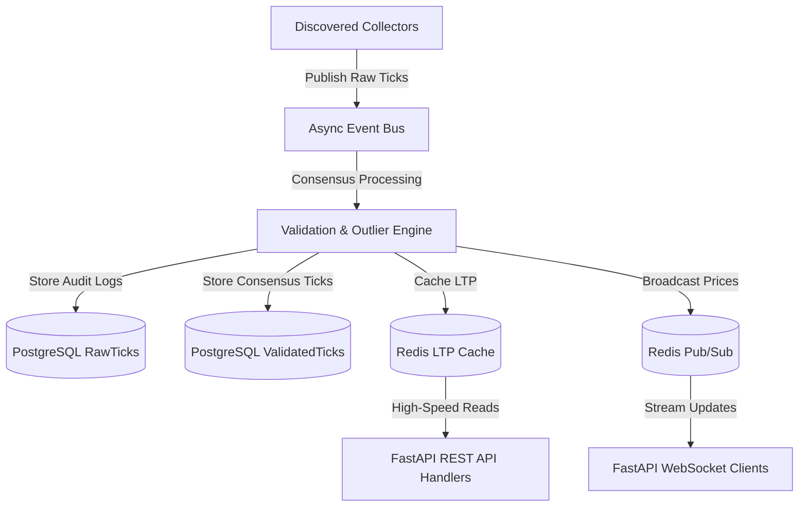

# Enterprise MCX Gold & Silver Market Data Platform

This platform is a dedicated, production-ready SaaS market data infrastructure built specifically for collecting, validating, and streaming live **MCX Gold** and **MCX Silver** prices.

---

## 1. System Architecture

The platform uses a highly decoupled, async event-driven architecture designed for high throughput, sub-20ms cached API responses, and resilient multi-source failover.



---

## 2. API Reference

All REST endpoints return a unified response envelope:

```json
{
  "success": true,
  "timestamp": "2026-06-30T13:28:00Z",
  "latency_ms": 12.3,
  "request_id": "4a7b5d12ef34...",
  "data": { ... },
  "error": null
}
```

### Key Endpoints
* **GET** `/api/v1/prices`: Returns latest cached quotes for both Gold and Silver.
* **GET** `/api/v1/gold`: Returns latest MCX Gold tick.
* **GET** `/api/v1/silver`: Returns latest MCX Silver tick.
* **GET** `/api/v1/history/{commodity}?interval=5m&limit=100`: Aggregated candles (`1s`, `5s`, `1m`, `5m`, `15m`, `1h`, `1d`) for `gold` or `silver`.
* **GET** `/api/v1/status`: Complete system diagnostics (DB state, Redis keys, active socket count, resources, collector metric leaderboard).
* **GET** `/api/v1/health`: Simple liveness and readiness check.
* **GET** `/api/v1/docs/postman`: Returns Postman Collection JSON.

---

## 3. Developer Integration Examples

### 1. cURL
```bash
curl -X GET "http://localhost/api/v1/prices?api_key=mcx_pub_dev_key"
```

### 2. Python
```python
import requests

class MCXClient:
    def __init__(self, base_url: str, api_key: str):
        self.base_url = base_url
        self.api_key = api_key

    def get_prices(self):
        res = requests.get(f"{self.base_url}/api/v1/prices", params={"api_key": self.api_key})
        return res.json()["data"]

client = MCXClient("http://localhost", "mcx_pub_dev_key")
print(client.get_prices())
```

### 3. JavaScript (Browser Fetch)
```javascript
fetch('http://localhost/api/v1/prices?api_key=mcx_pub_dev_key')
  .then(response => response.json())
  .then(payload => console.log(payload.data))
  .catch(error => console.error('Error:', error));
```

### 4. Node.js (Axios)
```javascript
const axios = require('axios');

axios.get('http://localhost/api/v1/prices', {
  params: { api_key: 'mcx_pub_dev_key' }
})
.then(res => console.log(res.data.data))
.catch(err => console.error(err));
```

### 5. Go
```go
package main

import (
	"encoding/json"
	"fmt"
	"io"
	"net/http"
)

func main() {
	url := "http://localhost/api/v1/prices?api_key=mcx_pub_dev_key"
	resp, err := http.Get(url)
	if err != nil {
		fmt.Println("Error:", err)
		return
	}
	defer resp.Body.Close()

	body, _ := io.ReadAll(resp.Body)
	var result map[string]interface{}
	json.Unmarshal(body, &result)
	fmt.Println(result["data"])
}
```

### 6. PHP
```php
<?php
$api_key = "mcx_pub_dev_key";
$url = "http://localhost/api/v1/prices?api_key=" . $api_key;
$ch = curl_init();
curl_setopt($ch, CURLOPT_URL, $url);
curl_setopt($ch, CURLOPT_RETURNTRANSFER, true);
$response = curl_exec($ch);
curl_close($ch);
$result = json_decode($response, true);
print_r($result['data']);
?>
```

---

## 4. WebSocket Client Integration

Clients can connect to `ws://localhost/api/v1/ws` and subscribe to real-time streams by passing the `gold`, `silver`, or `all` subscription parameter:

```javascript
const ws = new WebSocket("ws://localhost/api/v1/ws?api_key=mcx_pub_dev_key");

ws.onopen = () => {
    console.log("Connected to MCX Live Stream");
};

ws.onmessage = (event) => {
    const tick = JSON.parse(event.data);
    console.log(`Live Update [${tick.commodity}]: Rs. ${tick.price}`);
};
```

---

## 5. Deployment Guide

### One-Command Docker Compose Deployment
1. **Clone the repository** to your host.
2. **Start the stack** (automatically configures Nginx, Postgres, Redis, and FastAPI):
   ```bash
   docker compose up --build -d
   ```
3. **Verify running containers**:
   ```bash
   docker compose ps
   ```
4. Open the Developer Dashboard at `http://localhost/`.

### One-Click Railway Deployment
1. Log in to your [Railway Dashboard](https://railway.app/).
2. Click **New Project** -> **Deploy from GitHub repo**.
3. Select your cloned repository.
4. Add the required environment variables under the **Variables** tab (e.g. `PORT`).
5. Railway will automatically detect the `Dockerfile` and `railway.json` and boot the service with HTTPS enabled out of the box.
